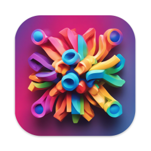
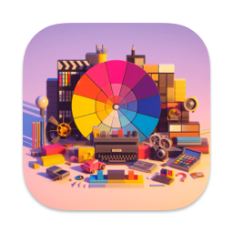

Quick Reference
===

<!--rehype:ignore:start-->
[](https://jaywcjlove.github.io/#/sponsor)
[](https://github.com/jaywcjlove/reference/actions/workflows/ci.yml)
[](https://hub.docker.com/r/wcjiang/reference)
[](https://hub.docker.com/r/wcjiang/reference)
[](https://hub.docker.com/r/wcjiang/reference)
<!--rehype:ignore:end-->

<!--rehype:ignore:start-->
[](https://jaywcjlove.github.io/reference)
<!--rehype:ignore:end-->

为了方便开发人员查阅技术栈，分享这份快速参考备忘清单【速查表】。这是英文版 [Reference](https://github.com/Randy8080/reference) 的中文翻译，旨在帮助自己更好地使用相关技术。如果您有自己的清单，也欢迎提供，我会抽时间搬运并立刻实现 :)。如果您发现这份备忘单中的内容不合适，可以通过提交 [PR](https://github.com/jaywcjlove/reference/blob/main/CONTRIBUTING.md) 来修复或提供更好的备忘清单，主要面向【中文】用户。以下是一些开源天使提供的备忘清单和快速参考 :)。

## 赞助支持
<!--rehype:class=home-title-reset-->

非常感谢一直以来支持我开源项目的朋友们！如果您认可我的工作，欢迎通过 [赞助](https://wangchujiang.com/#/sponsor)<!--rehype:target=_blank--> 我或下载并使用我开发的 [macOS 应用](https://wangchujiang.com/#/app)<!--rehype:target=_blank--> 来支持我。以下是我个人独立开发的 macOS 应用列表：

<p style="display: inline-block">
  <a target="_blank" href="https://apps.apple.com/app/6745227444" title="Musicer for macOS"></a>
  <a target="_blank" href="https://apps.apple.com/app/6743841447" title="Audioer for macOS"></a>
  <a target="_blank" href="https://apps.apple.com/app/6744690194" title="FileSentinel for macOS"></a>
  <a target="_blank" href="https://apps.apple.com/app/6743495172" title="FocusCursor for macOS"></a>
  <a target="_blank" href="https://apps.apple.com/app/6742680573" title="Videoer for macOS"></a>
  <a target="_blank" href="https://apps.apple.com/app/6740425504" title="KeyClicker for macOS"></a>
  <a target="_blank" href="https://apps.apple.com/app/6739052447" title="DayBar for macOS"></a>
  <a target="_blank" href="https://apps.apple.com/app/6739444407" title="Iconed for macOS"></a>
  <a target="_blank" href="https://apps.apple.com/app/6737160756" title="RightMenu Master for macOS"></a>
  <a target="_blank" href="https://apps.apple.com/app/6723903021" title="Paste Quick for macOS"></a>
  <a target="_blank" href="https://apps.apple.com/app/6670696072" title="Quick RSS for macOS/iOS"></a>
  <a target="_blank" href="https://apps.apple.com/app/6670167443" title="Web Serve for macOS"></a>
  <a target="_blank" href="https://apps.apple.com/app/6503953628" title="Copybook Generator for macOS/iOS"></a>
  <a target="_blank" href="https://apps.apple.com/app/6471227008" title="DevTutor for macOS/iOS"></a>
  <a target="_blank" href="https://apps.apple.com/app/6479819388" title="RegexMate for macOS/iOS"></a>
  <a target="_blank" href="https://apps.apple.com/app/6479194014" title="Time Passage for macOS/iOS"></a>
  <a target="_blank" href="https://apps.apple.com/app/6478772538" title="IconizeFolder for macOS"></a>
  <a target="_blank" href="https://apps.apple.com/app/6478511402" title="Textsound Saver for macOS/iOS"></a>
  <a target="_blank" href="https://apps.apple.com/app/6476924627" title="Create Custom Symbols for macOS"></a>
  <a target="_blank" href="https://apps.apple.com/app/6476452351" title="DevHub for macOS"></a>
  <a target="_blank" href="https://apps.apple.com/app/6476400184" title="Resume Revise for macOS"></a>
  <a target="_blank" href="https://apps.apple.com/app/6472593276" title="Palette Genius for macOS"></a>
  <a target="_blank" href="https://apps.apple.com/app/6470879005" title="Symbol Scribe for macOS"></a>
</p>
<!--rehype:style=padding-top:1rem;-->

## 正在建设中...

坑已挖，需要您的参与完善和[贡献](./docs/quickreference.md)！🙏
<!--rehype:style=padding-bottom: 23px;-->

[Ansible](./docs/ansible.md)<!--rehype:style=background: rgb(238 0 0);&class=contributing tag&data-lang=RedHat&data-info=👆看看还缺点儿什么？-->  
[CMake](./docs/cmake.md)<!--rehype:style=background: rgb(92 107 192);&class=contributing-->  
[C#](./docs/cs.md)<!--rehype:style=background: rgb(6 147 13);&class=contributing-->  
[Django](./docs/django.md)<!--rehype:style=background: rgb(12 75 51);&class=contributing tag&data-lang=Python-->  
[FFmpeg](./docs/ffmpeg.md)<!--rehype:style=background: rgb(0 193 9);&class=contributing-->  
[Flask](./docs/flask.md)<!--rehype:style=background: rgb(210 168 255);&class=contributing tag&data-lang=Python-->  
[FastAPI](./docs/fastapi.md)<!--rehype:style=background: rgb(210 168 255);&class=contributing tag&data-lang=Python-->  
[Flutter](./docs/flutter.md)<!--rehype:style=background: rgb(150 220 254);&class=contributing tag&data-lang=Dart-->  
[Gitlab CI/CD](./docs/gitlab-ci.md)<!--rehype:style=background: rgb(226 67 41);&class=contributing-->  
[LaTeX](./docs/latex.md)<!--rehype:style=background: rgb(0 128 128);&class=contributing-->  
[Lua](./docs/lua.md)<!--rehype:style=background: rgb(3 3 128);&class=contributing-->  
[NestJS](./docs/nestjs.md)<!--rehype:style=background: rgb(237 21 67);&class=contributing-->  
[MATLAB](./docs/matlab.md)<!--rehype:style=background: rgb(0 118 168);&class=contributing-->  
[Oracle](./docs/oracle.md)<!--rehype:style=background: rgb(255 0 0);&class=contributing tag&data-lang=SQL-->  
[Pytorch](./docs/pytorch.md)<!--rehype:style=background: rgb(238 76 44);&class=contributing tag&data-lang=Python&data-info=👆看看还缺点儿什么？-->  
[Vue 3](./docs/vue.md)<!--rehype:style=background: rgb(64 184 131);&class=contributing-->  
[Github Copilot](./docs/github-copilot.md)<!--rehype:style=background: rgb(125 45 220);&class=tag contributing&data-lang=AI&data-info=👆看看还缺点儿什么？-->  
[Chown](./docs/chown.md)<!--rehype:style=background: rgb(12 75 51/var(\-\-bg\-opacity));&class=contributing-->  
[R 语言](./docs/r.md)<!--rehype:style=background: rgb(39 108 192);&class=contributing-->  
[Elixir](./docs/elixir.md)<!--rehype:style=background: rgb(124 26 156);&class=contributing tag&data-lang=Elixir-->   
[Tauri](./docs/tauri.md)<!--rehype:style=background: rgb(103 214 237);&class=contributing-->
[Docker Compose](./docs/docker-compose.md)<!--rehype:style=background: rgb(72 143 223);&class=contributing tag&data-lang=Docker-->  
<!--rehype:class=home-card-->

## 编程

[Bash](./docs/bash.md)<!--rehype:style=background: rgb(72 143 223);-->  
[Powershell](./docs/powershell.md)<!--rehype:style=background: rgb(0 81 197);-->  
[C 语言](./docs/c.md)<!--rehype:style=background: rgb(92 107 192);-->  
[C#](./docs/cs.md)<!--rehype:style=background: rgb(6 147 13);&class=contributing-->  
[C++](./docs/cpp.md)<!--rehype:style=background: rgb(6 147 13);&class=contributing-->  
[Dart](./docs/dart.md)<!--rehype:style=background: rgb(64 196 255);-->  
[Docker](./docs/docker.md)<!--rehype:style=background: rgb(72 143 223);-->  
[Docker Compose](./docs/docker-compose.md)<!--rehype:style=background: rgb(72 143 223);&class=contributing tag&data-lang=Docker-->  
[Dockerfile](./docs/dockerfile.md)<!--rehype:style=background: rgb(0 72 153);&class=tag&data-lang=Docker-->  
[Django](./docs/django.md)<!--rehype:style=background: rgb(12 75 51);&class=contributing tag&data-lang=Python-->  
[Elixir](./docs/elixir.md)<!--rehype:style=background: rgb(124 26 156);&class=contributing tag&data-lang=Elixir-->   
[Erlang](./docs/erlang.md)<!--rehype:style=background: rgb(206 55 97);&class=contributing-->   
[Flask](./docs/flask.md)<!--rehype:style=background: rgb(210 168 255);&class=contributing tag&data-lang=Python-->  
[FastAPI](./docs/fastapi.md)<!--rehype:style=background: rgb(210 168 255);&class=contributing tag&data-lang=Python-->  
[Flutter](./docs/flutter.md)<!--rehype:style=background: rgb(150 220 254);&class=contributing tag&data-lang=Dart-->  
[Golang](./docs/golang.md)<!--rehype:style=background: rgb(39 160 193);-->  
[GraphQL](./docs/graphql.md)<!--rehype:style=background: rgb(214 66 146);-->  
[Hook](./docs/hook.md)<!--rehype:style=background: rgb(211 55 49);-->  
[Java](./docs/java.md)<!--rehype:style=background: rgb(211 55 49);&class=contributing&data-info=👆看看还缺点儿什么？-->  
[Julia](./docs/julia.md)<!--rehype:style=background: rgb(26 188 156);&class=contributing&data-info=👆看看还缺点儿什么？-->  
[Kotlin](./docs/kotlin.md)<!--rehype:style=background: rgb(211 55 49);&class=contributing&data-info=👆看看还缺点儿什么？-->  
[Kubernetes](./docs/kubernetes.md)<!--rehype:style=background: rgb(51 113 227);&class=contributing&data-info=👆看看还缺点儿什么？-->  
[LaTeX](./docs/latex.md)<!--rehype:style=background: rgb(0 128 128);&class=contributing-->  
[Laravel 8](./docs/laravel.md)<!--rehype:style=background: rgb(249 50 44);&class=contributing tag&data-lang=PHP-->  
[Markdown](./docs/markdown.md)<!--rehype:style=background: rgb(103 61 156);-->  
[MATLAB](./docs/matlab.md)<!--rehype:style=background: rgb(0 118 168);&class=contributing-->  
[PHP](./docs/php.md)<!--rehype:style=background: rgb(79 91 147);-->  
[Python](./docs/python.md)<!--rehype:style=background: rgb(43 91 132);-->  
[R 语言](./docs/r.md)<!--rehype:style=background: rgb(39 108 192);&class=contributing&data-info-->  
[Ruby](./docs/ruby.md)<!--rehype:style=background: rgb(204 52 45);-->  
[Rust](./docs/rust.md)<!--rehype:style=background: rgb(71 71 71);-->  
[Scala](./docs/scala.md)<!--rehype:style=background: rgb(34 82 94);-->  
[Swift](./docs/swift.md)<!--rehype:style=background: rgb(240 81 57);-->  
[SwiftUI](./docs/swiftui.md)<!--rehype:style=background: rgb(10 127 247);&class=tag&data-lang=swift-->  
[Spring Boot](./docs/springboot.md)<!--rehype:style=background: rgb(0 149 0);&class=tag&data-lang=Java-->  
[Lua](./docs/lua.md)<!--rehype:style=background: rgb(3 3 128);-->  
[Pytorch](./docs/pytorch.md)<!--rehype:style=background: rgb(238 76 44);&class=contributing tag&data-lang=Python&data-info=👆看看还缺点儿什么？-->  
[Jupyter](./docs/jupyter.md)<!--rehype:style=background: rgb(0 72 153);&class=tag&data-lang=Python-->  
[Minio](./docs/minio.md)<!--rehype:style=background: rgb(3 3 128);-->  
<!--rehype:class=home-card-->

## 配置

[INI](./docs/ini.md)<!--rehype:style=background: rgb(57 59 60);-->  
[JSON](./docs/json.md)<!--rehype:style=background: rgb(57 59 60);-->  
[TOML](./docs/toml.md)<!--rehype:style=background: rgb(132 132 132);-->  
[YAML](./docs/yaml.md)<!--rehype:style=background: rgb(91 163 230);-->  
<!--rehype:class=home-card-->

## 前端

[前端导航](./docs/feds.md)<!--rehype:style=background: rgb(35 115 205);&class=tag&data-lang=导航-->  
[Electron](./docs/electron.md)<!--rehype:style=background: rgb(0 72 153);-->  
[Emmet](./docs/emmet.md)<!--rehype:style=background: rgb(122 203 23);-->  
[ES 6](./docs/es6.md)<!--rehype:style=background: rgb(122 203 23);&class=tag&data-lang=JS-->  
[HTML](./docs/html.md)<!--rehype:style=background: rgb(228 77 39);-->  
[HTML Canvas](./docs/canvas.md)<!--rehype:style=background: rgb(228 77 39);-->  
[JavaScript](./docs/javascript.md)<!--rehype:style=background: rgb(203 183 31);-->  
[jQuery](./docs/jquery.md)<!--rehype:style=background: rgb(203 183 31);-->  
[Next.js](./docs/nextjs.md)<!--rehype:style=background: rgb(0 0 0);&class=tag&data-lang=React-->  
[RxJS](./docs/rxjs.md)<!--rehype:style=background: rgb(151 0 81);-->  
[React](./docs/react.md)<!--rehype:style=background: rgb(34 143 173);-->  
[React Router](./docs/reactrouter.md)<!--rehype:style=background: rgb(244 66 79);&class=tag&data-lang=React-->  
[React Native](./docs/react-native.md)<!--rehype:style=background: rgb(34 143 173);&class=tag&data-lang=React-->  
[TypeScript](./docs/typescript.md)<!--rehype:style=background: rgb(49 120 198);-->  
[Tauri](./docs/tauri.md)<!--rehype:style=background: rgb(103 214 237);&class=contributing-->  
[Vue 2](./docs/vue2.md)<!--rehype:style=background: rgb(64 184 131);&class=tag&data-lang=Vue-->  
[Vue 3](./docs/vue.md)<!--rehype:style=background: rgb(64 184 131);&class=tag&class=contributing tag&data-lang=Vue-->  
[</> htmx](./docs/htmx.md)<!--rehype:style=background: rgb(52 101 164);&class=contributing-->  
[Pinia](./docs/pinia.md)<!--rehype:style=background: rgb(44 136 50);&class=tag&data-lang=Vue-->  
<!--rehype:class=home-card-->

## CSS

[CSS 3](./docs/css.md)<!--rehype:style=background: rgb(35 115 205);&class=tag&data-lang=CSS-->  
[Styled Components](./docs/styled-components.md)<!--rehype:style=background: rgb(221 60 184);&class=tag&data-lang=CSS-->  
[Stylus](./docs/stylus.md)<!--rehype:style=background: rgb(109 161 63);&class=tag&data-lang=CSS-->  
[Sass](./docs/sass.md)<!--rehype:style=background: rgb(207 100 154);&class=tag&data-lang=CSS-->  
[Less.js](./docs/lessjs.md)<!--rehype:style=background: rgb(29 54 93);&class=tag&data-lang=CSS-->  
[Tailwind CSS](./docs/tailwindcss.md)<!--rehype:style=background: rgb(49 120 198);&class=tag&data-lang=CSS-->  
[StyleX](./docs/stylex.md)<!--rehype:style=background: rgb(91 79 163);&class=tag&data-lang=CSS-->  
<!--rehype:class=home-card-->

## Nodejs

[Express.js](./docs/expressjs.md)<!--rehype:style=background: rgb(95 151 206);-->  
[Ejs](./docs/ejs.md)<!--rehype:style=background: rgb(169 30 80);&class=tag&data-lang=JavaScript-->  
[Jest](./docs/jest.md)<!--rehype:style=background: rgb(153 66 91);-->  
[Koa.js](./docs/koajs.md)<!--rehype:style=background: rgb(95 151 206);-->  
[Lerna](./docs/lerna.md)<!--rehype:style=background: rgb(192 132 252);-->  
[npm](./docs/npm.md)<!--rehype:style=background: rgb(203 2 0);-->  
[NestJS](./docs/nestjs.md)<!--rehype:style=background: rgb(237 21 67);&class=contributing-->  
[PM2](./docs/pm2.md)<!--rehype:style=background: rgb(73 117 241);&class=contributing-->  
[package.json](./docs/package.json.md)<!--rehype:style=background: rgb(132 132 132);-->  
[Yarn](./docs/yarn.md)<!--rehype:style=background: rgb(33 136 182);-->  
[nvm](./docs/nvm.md)<!--rehype:style=background: rgb(132 132 132);-->  
[pnpm](./docs/pnpm.md)<!--rehype:style=background: rgb(191 133 0);-->  
[Bun](./docs/bun.md)<!--rehype:style=background: rgb(157 49 81);-->  
<!--rehype:class=home-card-->

## 命令

[ADB, Android Debug Bridge](./docs/adb.md)<!--rehype:style=background: rgb(238 0 0);&class=contributing tag&data-lang=Android&data-info=👆看看还缺点儿什么？-->  
[Ansible](./docs/ansible.md)<!--rehype:style=background: rgb(238 0 0);&class=contributing tag&data-lang=RedHat&data-info=👆看看还缺点儿什么？-->  
[Awk](./docs/awk.md)<!--rehype:style=background: rgb(16 185 129);-->  
[Curl](./docs/curl.md)<!--rehype:style=background: rgb(16 185 129);-->  
[Chmod](./docs/chmod.md)<!--rehype:style=background: rgb(16 185 129);-->  
[Chown](./docs/chown.md)<!--rehype:style=background: rgb(12 75 51/var(\-\-bg\-opacity));&class=contributing-->
[Cron](./docs/cron.md)<!--rehype:style=background: rgb(239 68 68);-->  
[CMake](./docs/cmake.md)<!--rehype:style=background: rgb(92 107 192);&class=contributing-->  
[CMD](./docs/cmd.md)<!--rehype:style=background: rgb(99 99 99);-->  
[.NET CLI](./docs/dotnet-cli.md)<!--rehype:style=background: rgb(16 185 129);&class=contributing tag&data-lang=#C-->  
[Find](./docs/find.md)<!--rehype:style=background: rgb(16 185 129);-->  
[FFmpeg](./docs/ffmpeg.md)<!--rehype:style=background: rgb(0 193 9);&class=contributing-->  
[Gdb](./docs/gdb.md)<!--rehype:style=background: rgb(215 89 62);-->  
[Glances](./docs/glances.md)<!--rehype:style=background: rgb(16 185 129);-->  
[Grep](./docs/grep.md)<!--rehype:style=background: rgb(16 185 129);-->  
[Htop](./docs/htop.md)<!--rehype:style=background: rgb(16 185 129);-->  
[iptables](./docs/iptables.md)<!--rehype:style=background: rgb(32 74 135);-->  
[jq](./docs/jq.md)<!--rehype:style=background: rgb(16 185 129);&class=tag&data-lang=JSON-->  
[Justfile](./docs/justfile.md)<!--rehype:style=background: rgb(16 185 129);-->  
[Lsof](./docs/lsof.md)<!--rehype:style=background: rgb(16 185 129);-->  
[Make](./docs/make.md)<!--rehype:style=background: rgb(99 99 99);&class=contributing-->  
[Netstat](./docs/netstat.md)<!--rehype:style=background: rgb(16 185 129);-->  
[Netcat](./docs/netcat.md)<!--rehype:style=background: rgb(4 92 135);-->  
[OpenSSL](./docs/openssl.md)<!--rehype:style=background: rgb(114 20 18);-->  
[ps](./docs/ps.md)<!--rehype:style=background: rgb(99 99 99);-->  
[Pandoc](./docs/pandoc.md)<!--rehype:style=background: rgb(99 99 99);&class=tag&data-lang=文档转换器-->  
[Sed](./docs/sed.md)<!--rehype:style=background: rgb(16 185 129);-->  
[Systemd](./docs/systemd.md)<!--rehype:style=background: rgb(16 185 129);-->  
[SSH](./docs/ssh.md)<!--rehype:style=background: rgb(99 99 99);-->  
[Screen](./docs/screen.md)<!--rehype:style=background: rgb(99 99 99);-->  
[Sysdig](./docs/sysdig.md)<!--rehype:style=background: rgb(1 171 199);-->  
[Tmux](./docs/tmux.md)<!--rehype:style=background: rgb(99 99 99);-->  
[Taskset](./docs/taskset.md)<!--rehype:style=background: rgb(99 99 99);-->  
[tar](./docs/tar.md)<!--rehype:style=background: rgb(215 89 62);&class=tag&data-lang=解压缩-->  
[Yazi](./docs/yazi.md)<!--rehype:style=background: rgb(255 165 0);&class=tag&data-lang=文件管理器;&class=contributing-->  
[Zip](./docs/zip.md)<!--rehype:style=background: rgb(99 99 99);&class=tag&data-lang=解压缩-->  
[FTP](./docs/ftp.md)<!--rehype:style=background: rgb(99 99 99);-->  
<!--rehype:class=home-card-->

## 工具

[ChatGPT](./docs/chatgpt.md)<!--rehype:style=background: rgb(74, 161, 129);&class=tag&data-lang=AI-->
[Emacs](./docs/emacs.md)<!--rehype:style=background: rgb(98 36 134);-->  
[Linux Command](./docs/linux-command.md)<!--rehype:style=background: rgb(215 89 62);&class=tag&data-lang=命令速查-->  
[Mitmproxy](./docs/mitmproxy.md)<!--rehype:style=background: rgb(4 92 135);-->  
[nginx](./docs/nginx.md)<!--rehype:style=background: rgb(0 153 0);-->  
[RegEx 正则表达式](./docs/regex.md)<!--rehype:style=background: rgb(149 36 155);-->  
[Semver 语义化版本](./docs/semver.md)<!--rehype:style=background: rgb(106 111 141);-->  
[Vim](./docs/vim.md)<!--rehype:style=background: rgb(9 150 8);-->  
[XPath](./docs/xpath.md)<!--rehype:style=background: rgb(91 163 230);-->  
<!--rehype:class=home-card-->

## 软件包管理器

[APT](./docs/apt.md)<!--rehype:style=background: rgb(30 144 255);-->  
[Conan](./docs/conan.md)<!--rehype:style=background: rgb(0 193 9);&class=tag&data-lang=C/C++-->  
[Conda](./docs/conda.md)<!--rehype:style=background: rgb(68 168 51);&class=tag&data-lang=Python-->  
[CocoaPods](./docs/cocoapods.md)<!--rehype:style=background: rgb(251 0 6);&class=tag&data-lang=C/C++-->  
[Cargo](./docs/cargo.md)<!--rehype:style=background: rgb(71 71 71);&class=tag&data-lang=Rust-->  
[Homebrew](./docs/homebrew.md)<!--rehype:style=background: rgb(252 185 87);&class=tag&data-lang=macOS-->  
[Pacman](./docs/pacman.md)<!--rehype:style=background: rgb(24 147 209);&class=tag&data-lang=archlinux&class=contributing-->  
[pip](./docs/pip.md)<!--rehype:style=background: rgb(24 147 209);&class=tag&data-lang=Python&class=contributing-->  
[YUM](./docs/yum.md)<!--rehype:style=background: rgb(86 86 123);-->  
[SDKMAN](./docs/sdkman.md)<!--rehype:style=background: rgb(0 118 198);-->  
<!--rehype:class=home-card-->

## Git 版本控制

[Git](./docs/git.md)<!--rehype:style=background: rgb(215 89 62);&class=tag&data-lang=版本控制-->  
[Github](./docs/github.md)<!--rehype:style=background: rgb(36 41 47);-->  
[Github Copilot](./docs/github-copilot.md)<!--rehype:style=background: rgb(125 45 220);&class=tag contributing&data-lang=AI&data-info=👆看看还缺点儿什么？-->  
[Github CLI](./docs/github-cli.md)<!--rehype:style=background: rgb(36 41 47);-->  
[Github Actions](./docs/github-actions.md)<!--rehype:style=background: rgb(121 184 255);-->  
[Gitlab CI/CD](./docs/gitlab-ci.md)<!--rehype:style=background: rgb(226 67 41);&class=contributing-->  
[Subversion (SVN)](./docs/subversion.md)<!--rehype:style=background: rgb(99 99 99);&class=tag&data-lang=版本控制-->  
<!--rehype:class=home-card-->

## 数据库

[MySQL](./docs/mysql.md)<!--rehype:style=background: rgb(1 117 143);&class=tag&data-lang=SQL-->  
[MongoDB](./docs/mongodb.md)<!--rehype:style=background: rgb(0 237 100);-->  
[Oracle](./docs/oracle.md)<!--rehype:style=background: rgb(255 0 0);&class=tag&data-lang=SQL-->  
[PostgreSQL](./docs/postgres.md)<!--rehype:style=background: rgb(43 109 163);&class=tag&data-lang=SQL-->  
[Redis](./docs/redis.md)<!--rehype:style=background: rgb(198 47 44);-->  
[Elasticsearch](./docs/elasticsearch.md)<!--rehype:style=background: rgb(36 187 177);-->  
[Neo4j](./docs/neo4j.md)<!--rehype:style=background: rgb(86 86 123);-->
[SQLite](./docs/sqlite.md)<!--rehype:style=background: rgb(0 59 90);-->
<!--rehype:class=home-card-->

## 快捷键

[Adobe Lightroom](./docs/adobe-lightroom.md)<!--rehype:style=background: rgb(49 168 255);-->  
[Adobe Photoshop](./docs/adobe-photoshop.md)<!--rehype:style=background: rgb(49 168 255);-->  
[Adobe XD](./docs/adobe-xd.md)<!--rehype:style=background: rgb(255 97 246);-->  
[Android Studio](./docs/android-studio.md)<!--rehype:style=background: rgb(16 185 129);-->  
[Blender](./docs/blender.md)<!--rehype:style=background: rgb(16 185 129);-->  
[Firefox](./docs/firefox.md)<!--rehype:style=background: rgb(253 53 76);-->  
[Finder](./docs/finder.md)<!--rehype:style=background: rgb(253 53 76);&class=tag&data-lang=macOS-->  
[Figma](./docs/figma.md)<!--rehype:style=background: rgb(147 90 238);-->  
[Gmail](./docs/gmail.md)<!--rehype:style=background: rgb(234 67 54);-->  
[Gitlab](./docs/gitlab.md)<!--rehype:style=background: rgb(226 67 41);-->  
[Google Chrome](./docs/google-chrome.md)<!--rehype:style=background: rgb(29 116 232);-->  
[IntelliJ IDEA](./docs/intelli-j-idea.md)<!--rehype:style=background: rgb(223 148 0);&class=tag&data-lang=Java-->  
[PyCharm](./docs/pycharm.md)<!--rehype:style=background: rgb(36 215 137);&class=tag&data-lang=Python-->  
[PhpStorm](./docs/phpstorm.md)<!--rehype:style=\-\-bg\-opacity: 0.75;background-image: linear-gradient(to left, rgba(255 106 172 / var(\-\-bg\-opacity)), rgba(183 173 255 / var(\-\-bg\-opacity)));-->  
[Sketch](./docs/sketch.md)<!--rehype:style=background: rgb(223 148 0);&class=tag&data-lang=macOS-->  
[Sublime Text](./docs/sublime-text.md)<!--rehype:style=background: rgb(223 148 0);-->  
[Vimium](./docs/vimium.md)<!--rehype:style=background: rgb(49 168 255);&class=contributing&class=tag&data-lang=浏览器插件-->
[VSCode](./docs/vscode.md)<!--rehype:style=background: rgb(91 163 230);-->  
[Twitter(X)](./docs/twitter.md)<!--rehype:style=background: rgb(91 163 230);-->  
[WebStorm](./docs/webstorm.md)<!--rehype:style=background: rgb(32 148 220);-->  
[Xcode](./docs/xcode.md)<!--rehype:style=background: rgb(24 151 233);&class=tag&data-lang=macOS-->  
[Zed](./docs/zed.md)<!--rehype:style=background: rgb(71 71 71);-->  
<!--rehype:class=home-card-->

## 其它

[Quick Reference](./docs/quickreference.md)<!--rehype:style=background: rgb(0 182 122);&class=tag&data-lang=排版说明-->  
[Aspect Ratio](./docs/aspect-ratio.md)<!--rehype:style=background: rgb(16 185 129);-->  
[ASCII Code](./docs/ascii-code.md)<!--rehype:style=background: rgb(16 185 129);-->  
[Symbol Code](./docs/symbol-code.md)<!--rehype:style=background: rgb(16 185 129);-->  
[Colors Named](./docs/colors-named.md)<!--rehype:style=background: rgb(16 185 129);&class=tag&data-lang=CSS-->  
[HTTP 状态码](./docs/http-status-code.md)<!--rehype:style=background: rgb(16 185 129);-->  
[HTML 字符实体](./docs/html-char.md)<!--rehype:style=background: rgb(16 185 129);&class=tag&data-lang=HTML-->  
[ISO-3166 国家代码](./docs/iso-3166-1.md)<!--rehype:style=background: rgb(16 185 129);-->  
[ISO-639 语言代码](./docs/iso-639-1.md)<!--rehype:style=background: rgb(16 185 129);-->  
[Emoji](./docs/emoji.md)<!--rehype:style=\-\-bg\-opacity: 0.75;background-image: linear-gradient(to left, rgba(74 222 128 / var(\-\-bg\-opacity)), rgba(59 130 246 / var(\-\-bg\-opacity)));-->  
[MIME types](./docs/mime.md)<!--rehype:style=background: rgb(16 185 129);-->  
[Resolutions](./docs/resolutions.md)<!--rehype:style=background: rgb(16 185 129);-->  
[时区列表](./docs/time-zones.md)<!--rehype:style=background: rgb(16 185 129);-->  
[常见端口对照](./docs/ports.md)<!--rehype:style=background: rgb(16 185 129);-->  
<!--rehype:class=home-card-->

## 看到缺少什么了吗？
<!--rehype:wrap-style=text-align: center;max-width: 650px;margin: 0 auto;padding-top:4rem;&class=home-title-reset-->

上面的列表没有看到你想要的？ 您是否正在寻找一些备忘清单或参考资料，或者您有一些片段备忘清单要分享，这是一个最好的机会！

[`请求添加备忘单(速查表)`](https://github.com/jaywcjlove/reference/issues/new?template=cheatsheet-request.yml)<!--rehype:class=home-button&style=margin-top:2rem&target=__blank-->
[`我有一张备忘单(速查表)`](https://github.com/jaywcjlove/reference/blob/main/CONTRIBUTING.md)<!--rehype:class=home-button text-grey&target=__blank-->
<!--rehype:style=margin-top:3rem-->

## 感谢所有贡献者
<!--rehype:wrap-style=text-align: center;max-width: 650px;margin: 0 auto;&class=home-title-reset-->

请参阅 [Quick Reference](./docs/quickreference.md) 了解如何开始。一如既往，感谢我们出色的[贡献者](https://github.com/jaywcjlove/reference/graphs/contributors)！
<!--rehype:style=padding-bottom:1rem;-->

<!--GAMFC-->
<a href="https://github.com/jaywcjlove" title="小弟调调"></a>
<a href="https://github.com/fwqaaq" title="fwqaaq"></a>
<a href="https://github.com/zhangymPerson" title="zhangym"></a>
<a href="https://github.com/mofelee" title="mofelee"></a>
<a href="https://github.com/Country-If" title="Maylon"></a>
<a href="https://github.com/JeffersonHuang" title="Jefferson Huang"></a>
<a href="https://github.com/LesterChang0987" title="Steve Hartwell"></a>
<a href="https://github.com/h7ml" title="h7ml"></a>
<a href="https://github.com/nangongchengfeng" title="南宫乘风"></a>
<a href="https://github.com/aixcyi" title="阿羽"></a>
<a href="https://github.com/LufsX" title="LufsX"></a>
<a href="https://github.com/alex-reinfoce" title="Alex"></a>
<a href="https://github.com/mailbaoer" title="baoer"></a>
<a href="https://github.com/expoli" title="expoli"></a>
<a href="https://github.com/k23223" title="k23223"></a>
<a href="https://github.com/eryajf" title="二丫讲梵"></a>
<a href="https://github.com/undefined-hestudio" title="undefined"></a>
<a href="https://github.com/Darkiiiiiice" title="Darkiiiiiice"></a>
<a href="https://github.com/genius-kim" title="Kim同学"></a>
<a href="https://github.com/qyl27" title="雨落"></a>
<a href="https://github.com/MackDing" title="Blossom"></a>
<a href="https://github.com/1250422131" title="萌新杰少"></a>
<a href="https://github.com/richuff" title="richuff"></a>
<a href="https://github.com/Harris-H" title="Hao He"></a>
<a href="https://github.com/LiuYuan-SHU" title="Yuan Liu"></a>
<a href="https://github.com/long-910" title="Small Long"></a>
<a href="https://github.com/Willxup" title="Will"></a>
<a href="https://github.com/xia0ne" title="YuRuiH"></a>
<a href="https://github.com/chaos-cn" title="chaos"></a>
<a href="https://github.com/QinIndexCode" title="fault"></a>
<a href="https://github.com/wsypower" title="魏"></a>
<a href="https://github.com/wangdaodao" title="王叨叨"></a>
<a href="https://github.com/itldg" title="老大哥"></a>
<a href="https://github.com/buyfakett" title="buyfakett"></a>
<a href="https://github.com/catcto" title="小武Alan"></a>
<a href="https://github.com/witt-bit" title="witt"></a>
<a href="https://github.com/ryanhex53" title="ryanhex53"></a>
<a href="https://github.com/partoneplay" title="佐博"></a>
<a href="https://github.com/pangxiaoli" title="pangxiaoli"></a>
<a href="https://github.com/mancuoj" title="mancuoj"></a>
<a href="https://github.com/1834423612" title="kjch"></a>
<a href="https://github.com/AmosHuKe" title="Amos"></a>
<a href="https://github.com/qjksxy" title="Apin"></a>
<a href="https://github.com/dadatom" title="Da Da"></a>
<a href="https://github.com/ljq" title="Jack Liu"></a>
<a href="https://github.com/jasnzhuang" title="Jason Zhuang"></a>
<a href="https://github.com/Jovins" title="Jovins"></a>
<a href="https://github.com/infanx" title="infanx"></a>
<a href="https://github.com/greyhao" title="greyhao"></a>
<a href="https://github.com/izven" title="Zhang"></a>
<a href="https://github.com/Kisa-Dong" title="Kisa-Dong"></a>
<a href="https://github.com/SuperDiscovery" title="SuperDiscovery"></a>
<a href="https://github.com/XYZscratcher" title="XYZ"></a>
<a href="https://github.com/ThanatosXingYu" title="Thanatos"></a>
<a href="https://github.com/hweining" title="hweining"></a>
<a href="https://github.com/icer233" title="icer"></a>
<a href="https://github.com/auroraslot" title="irony"></a>
<a href="https://github.com/jlchen5" title="J.Chen"></a>
<a href="https://github.com/jldxpm" title="jldxjldx"></a>
<a href="https://github.com/joyfully-W" title="joyfully-W"></a>
<a href="https://github.com/jqzhao7" title="jqzhao"></a>
<a href="https://github.com/jussker" title="jussker"></a>
<a href="https://github.com/kcmeven" title="Evan-k"></a>
<a href="https://github.com/kdxcxs" title="kdxcxs"></a>
<a href="https://github.com/kubeme" title="kubernetes for me"></a>
<a href="https://github.com/larry-xue" title="yujian(larry) xue"></a>
<a href="https://github.com/leauny" title="leauny"></a>
<a href="https://github.com/liliangrong777" title="liliangrong777"></a>
<a href="https://github.com/lozhu20" title="lozhu"></a>
<a href="https://github.com/yanxuplay" title="hupilan"></a>
<a href="https://github.com/hua03" title="hua03"></a>
<a href="https://github.com/gzttcydxx" title="gzttcydxx"></a>
<a href="https://github.com/sunny0826" title="Xudong Guo"></a>
<a href="https://github.com/nodjoy" title="gowshwah"></a>
<a href="https://github.com/godot42x" title="godot42"></a>
<a href="https://github.com/gi-b716" title="Gavin"></a>
<a href="https://github.com/fjqz177" title="fjqz177"></a>
<a href="https://github.com/fenglielie" title="fenglielie"></a>
<a href="https://github.com/fakevn" title="fakevn"></a>
<a href="https://github.com/emoji-share" title="emoji-share🤪"></a>
<a href="https://github.com/cool9203" title="cool9203"></a>
<a href="https://github.com/gaoxiaoduan" title="Coder Duan"></a>
<a href="https://github.com/lijc210" title="cizai"></a>
<a href="https://github.com/chyok" title="chyok"></a>
<a href="https://github.com/Zeng-qh" title="都一样"></a>
<a href="https://github.com/binscor" title="binscor"></a>
<a href="https://github.com/qwxingzhe" title="行者"></a>
<a href="https://github.com/lisheng741" title="芦荟柚子茶"></a>
<a href="https://github.com/rainbowatcher" title="rainbowatcher"></a>
<a href="https://github.com/HChenX" title="焕晨HChen"></a>
<a href="https://github.com/LebranceBW" title="落叶乌龟"></a>
<a href="https://github.com/sundakai" title="永恒"></a>
<a href="https://github.com/LongYinStudio" title="敬培全"></a>
<a href="https://github.com/Fengjing95" title="小枫"></a>
<a href="https://github.com/ZIDOUZI" title="子斗子"></a>
<a href="https://github.com/LuckyJie12" title="夜未央"></a>
<a href="https://github.com/kele527" title="吹衣轻飏"></a>
<a href="https://github.com/lvzhenbo" title="无聊波波"></a>
<a href="https://github.com/zxx457" title="Xianxin Zeng"></a>
<a href="https://github.com/zhouhw0306" title="zhouhw0306"></a>
<a href="https://github.com/hiyms" title="yms"></a>
<a href="https://github.com/giteeking" title="xunjian"></a>
<a href="https://github.com/xing133" title="xing133"></a>
<a href="https://github.com/wjjwkwindy" title="Hudson Alen"></a>
<a href="https://github.com/wannima66" title="tmen"></a>
<a href="https://github.com/swift-fs" title="swift-fs"></a>
<a href="https://github.com/suyangzuo" title="suyangzuo"></a>
<a href="https://github.com/Mowmowj" title="nexo"></a>
<a href="https://github.com/shanhai1024" title="shanhai1024"></a>
<a href="https://github.com/ri-fumo" title="ri-fumo"></a>
<a href="https://github.com/phygerr" title="phygerr"></a>
<a href="https://github.com/openapphub" title="openapphub"></a>
<a href="https://github.com/onewesong" title="onewesong"></a>
<a href="https://github.com/miclon-dev" title="miclon-dev"></a>
<a href="https://github.com/lykjjj" title="lykjjj"></a>
<a href="https://github.com/zlfyuan" title="bgbgPang"></a>
<a href="https://github.com/mariuszmichalowski" title="Mariusz Michalowski"></a>
<a href="https://github.com/isecret" title="Mao Wang"></a>
<a href="https://github.com/lvelvee" title="Lve Lvee"></a>
<a href="https://github.com/likeadmin-likeshop" title="likeadmin通过管理后台-likeshop全开源商城"></a>
<a href="https://github.com/Lihuagreek" title="Lihuagreek"></a>
<a href="https://github.com/LightQuanta" title="Light_Quanta"></a>
<a href="https://github.com/JetSquirrel" title="JetSquirrel"></a>
<a href="https://github.com/jeremyjone" title="Jeremy Jone"></a>
<a href="https://github.com/JavaZeroo" title="JavaZero"></a>
<a href="https://github.com/Ding-Kyoma" title="HooinKyoma"></a>
<a href="https://github.com/gongyeheyu" title="GONGYE Heyu"></a>
<a href="https://github.com/Furry-Monster" title="Furry-Monster"></a>
<a href="https://github.com/Fuku-L" title="Foozi"></a>
<a href="https://github.com/sirius-fan" title="Fan"></a>
<a href="https://github.com/eeeeeio" title="EEEEE"></a>
<a href="https://github.com/demigodliu" title="DemigodLiu"></a>
<a href="https://github.com/dasferco" title="Dasferco"></a>
<a href="https://github.com/Damao2250" title="Damao"></a>
<a href="https://github.com/daining810" title="dain"></a>
<a href="https://github.com/DEEMO101" title="DEEMO101"></a>
<a href="https://github.com/ohto-ai" title="Choo"></a>
<a href="https://github.com/CharlotteZeng" title="hanchZ"></a>
<a href="https://github.com/ch3nnn" title="chentong"></a>
<a href="https://github.com/Brid9e" title="Joe"></a>
<a href="https://github.com/BobH-Official" title="BobH"></a>
<a href="https://github.com/Blanket58" title="Blanket58"></a>
<a href="https://github.com/BlacAmDK" title="BlacAmDK"></a>
<a href="https://github.com/gitchenze" title="Aze"></a>
<a href="https://github.com/dousha0w0" title="dousha0w0"></a>
<a href="https://github.com/JinchuanL" title="ANDY"></a>
<a href="https://github.com/13812700839" title="花殇"></a>
<a href="https://github.com/Lmmmmmm-bb" title="_lmmmmmm"></a>
<a href="https://github.com/y52y" title="Zyj"></a>
<a href="https://github.com/Leaderzhangyi" title="ZinkCas"></a>
<a href="https://github.com/zhu0629" title="zhucong"></a>
<a href="https://github.com/yikuaibro" title="yikuaibro"></a>
<a href="https://github.com/HeZephyr" title="Zephyr He"></a>
<a href="https://github.com/dfshizhiqiang" title="Zech"></a>
<a href="https://github.com/zkassing" title="You Kuan Zhang"></a>
<a href="https://github.com/Yo-gurts" title="Yogurt"></a>
<a href="https://github.com/hi-liyan" title="李李李"></a>
<a href="https://github.com/BATTLEHAWK00" title="While True: learn()"></a>
<a href="https://github.com/dwgeneral" title="Happy-Engineer"></a>
<a href="https://github.com/whb1998a" title="Wafer"></a>
<a href="https://github.com/YLee9527" title="Terry Young"></a>
<a href="https://github.com/TRDSCSH" title="TRDSCSH"></a>
<a href="https://github.com/Xiwin" title="shawing"></a>
<a href="https://github.com/DataEraserC" title="Sacabambaspis"></a>
<a href="https://github.com/qinxiongzhou" title="Ryan Zhou"></a>
<a href="https://github.com/RivailleF" title="RivailleF"></a>
<a href="https://github.com/Qliangw" title="Qliangw"></a>
<a href="https://github.com/QDelta" title="QDelta"></a>
<a href="https://github.com/sevenleave" title="Poirot Hercule"></a>
<a href="https://github.com/PipecraftNet" title="Pipecraft"></a>
<a href="https://github.com/Perzch" title="ZhaoChunhuan"></a>
<a href="https://github.com/PILIHU2022" title="Spark"></a>
<a href="https://github.com/Noryu-01" title="Noryu"></a>
<a href="https://github.com/NianwenDan" title="NianwenDan"></a>
<a href="https://github.com/mo3et" title="Monet Lee"></a>
<a href="https://github.com/Moeyuuko" title="Moeyuuko"></a>
<a href="https://github.com/malcolmyu" title="Minghao Yu"></a>
<a href="https://github.com/Mieriki" title="Mieriki"></a>


<!--GAMFC-END-->

[贡献者](https://github.com/jaywcjlove/reference/graphs/contributors)列表，由 [contributors](https://github.com/jaywcjlove/github-action-contributors) 根据提交次数的先后顺序自动生成
<!--rehype:style=padding-top:1rem;-->

## 国内镜像网站
<!--rehype:wrap-style=text-align: center;max-width: 650px;margin: 0 auto;&class=home-title-reset-->

由于中国国内访问，时常打不开，你可以访问下面镜像网站(国内打不开的不再收录)。推荐自己的[镜像网站](https://github.com/jaywcjlove/reference/discussions/206#discussion-4625735)

[quickref.cn](https://quickref.cn)<!--rehype:target=_blank-->
[78888889.xyz](https://reference.78888889.xyz)<!--rehype:target=_blank-->
[pusukeji.com](https://reference.pusukeji.com/)<!--rehype:target=_blank-->
[magese.com](https://ref.magese.com)<!--rehype:target=_blank-->
[doraemon.press](https://reference.doraemon.press/)<!--rehype:target=_blank-->
[foreverlink.love](https://reference.foreverlink.love)<!--rehype:target=_blank-->
[xod.cc](https://ref.xod.cc)<!--rehype:target=_blank&class=contributing&data-info=👆每天自动同步-->
[jhao.me](http://reference.jhao.me/)<!--rehype:target=_blank-->
[maoo.me](https://note.maoo.me)<!--rehype:target=_blank&class=contributing&data-info=👆每天自动同步-->
[luckyits.com](https://ref.luckyits.com/)<!--rehype:target=_blank&class=contributing&data-info=👆每天自动同步-->
[9up.dev](https://devref.9up.dev)<!--rehype:target=_blank-->
[ylmty.cc](https://docs.ylmty.cc)<!--rehype:target=_blank-->
[mingming.dev](https://ref.mingming.dev)<!--rehype:target=_blank-->
[itzcy.com](https://reference.itzcy.com/)<!--rehype:target=_blank-->
[ref.v-ta.com](https://ref.v-ta.com)<!--rehype:target=_blank-->
[eryajf.net](https://ref.eryajf.net/)<!--rehype:target=_blank-->
[isteed.cc](https://ref.isteed.cc/)<!--rehype:target=_blank-->
[666666.dev](https://cheat.666666.dev)<!--rehype:target=_blank&data-info=👆每天自动同步-->
[srebro.cn](https://ref.srebro.cn)<!--rehype:target=_blank&data-info=👆每天自动同步-->
[guoxudong.io](https://reference.guoxudong.io/)<!--rehype:target=_blank&class=contributing&data-info=👆每天自动同步-->
[terryyoung.cn](http://ref.terryyoung.cn/)<!--rehype:target=_blank&class=contributing&data-info=👆每周一三五自动同步-->
[quickref.binscor.top](https://quickref.binscor.top)<!--rehype:target=_blank&data-info=👆每天自动同步-->
[zone.id](https://cyref.zone.id/)<!--rehype:target=_blank-->
[aibk.cn](https://quickref.aibk.cn)<!--rehype:target=_blank-->
[docflow.cn](https://ref.docflow.cn)<!--rehype:target=_blank-->
[quickref.hestudio.net](https://quickref.hestudio.net)<!--rehype:target=_blank&class=contributing&data-info=👆整点自动同步-->
[qiubit.cc](http://ref.qiubit.cc)<!--rehype:target=_blank&class=contributing&data-info=👆每天自动同步-->
[moeyuuko.com](https://ref.moeyuuko.com/)<!--rehype:target=_blank&class=contributing&data-info=👆每天自动同步-->
[haah.net](https://ref.haah.net)<!--rehype:target=_blank&data-info=👆每天自动同步-->
[ownit.top](https://memo.ownit.top)<!--rehype:target=_blank&data-info=👆每十分钟自动同步-->
[laoleng.vip](http://bbs.laoleng.vip/reference/)<!--rehype:target=_blank-->
[if010.com](https://quickref.if010.com/)<!--rehype:target=_blank-->
[cms.im](https://quickref.cms.im/)<!--rehype:target=_blank-->
[itcent.cn](https://code.itcent.cn/)<!--rehype:target=_blank-->
[coolxy.top](https://refer.coolxy.top)<!--rehype:target=_blank-->
[kclouder.cn](https://www.kclouder.cn/reference)<!--rehype:target=_blank-->
[xalaok.top](https://ref.xalaok.top)<!--rehype:target=_blank-->
[hao.kim](https://ref.hao.kim)<!--rehype:target=_blank-->
[tool.sakura.vin](https://tool.sakura.vin/ref/)<!--rehype:target=_blank-->
[chenchen.site](https://img.chenchen.site/reference/)<!--rehype:target=_blank-->
[jgeek.cn](http://reference.jgeek.cn/)<!--rehype:target=_blank-->
[gaojs.com.cn](https://study.gaojs.com.cn)<!--rehype:target=_blank-->
[15926.tech](https://ref.15926.tech)<!--rehype:target=_blank-->
[okhk.net](https://ref.okhk.net)<!--rehype:target=_blank-->
[wdft.com](https://ref.wdft.com)<!--rehype:target=_blank-->
[likui.info](https://r.likui.info)<!--rehype:target=_blank-->
[ruiange.work](https://code.ruiange.work/)<!--rehype:target=_blank-->
[denganliang.com](https://ref.denganliang.com)<!--rehype:target=_blank-->
[ivanz.cc](https://ref.ivanz.cc)<!--rehype:target=_blank-->
[dev6.site](https://ref.dev6.site/)<!--rehype:target=_blank-->
[zishu.me](https://ref.zishu.me/)<!--rehype:target=_blank-->
[sucan2233.cn](http://reference.sucan2233.cn)<!--rehype:target=_blank-->
[bobh.cool](https://quickref.bobh.cool)<!--rehype:target=_blank-->
[tangwudi.com](https://doc.tangwudi.com)<!--rehype:target=_blank-->
[osz.icu](https://ref.osz.icu/)<!--rehype:target=_blank-->
[docs.willxup.top](https://docs.willxup.top)<!--rehype:target=_blank-->
[wangchunfei.com](https://ref.wangchunfei.com/)<!--rehype:target=_blank-->
[object.cool](https://r.object.cool)<!--rehype:target=_blank-->
[jeremyjone.com](https://ref.jeremyjone.com/)<!--rehype:target=_blank-->
[gistudy.net](https://reference.gistudy.net/)<!--rehype:target=_blank-->
[deyout.com](https://ref.deyout.com)<!--rehype:target=_blank-->
[const.team](https://reference.const.team)<!--rehype:target=_blank-->
[liamng.top](https://refer.liamng.top/)<!--rehype:target=_blank-->
[zcsk18.cn](https://reference.zcsk18.cn/)<!--rehype:target=_blank-->
[hhxyrk.icu](http://hhxy.hhxyrk.icu/)<!--rehype:target=_blank-->
[vhcffh.com](https://docs.vhcffh.com)<!--rehype:target=_blank-->
[childish.vip](https://reference.childish.vip)<!--rehype:target=_blank-->
[hackshen.com](https://reference.hackshen.com)<!--rehype:target=_blank-->
[afetera.top](https://note.afetera.top)<!--rehype:target=_blank-->
[trtuaazz.com](https://reference.trtuaazz.com)<!--rehype:target=_blank-->
[anhaoyang.com](http://dev-doc.anhaoyang.com/)<!--rehype:target=_blank-->
[xxcxx.lat](https://xxcxx.lat/)<!--rehype:target=_blank-->
[fishlee.net](https://cr.fishlee.net/)<!--rehype:target=_blank-->
[yunshangmanyou.com](https://quick.yunshangmanyou.com)<!--rehype:target=_blank-->
[xiaokaixuan.com](https://xiaokaixuan.com/xkx/rq/index.html)<!--rehype:target=_blank-->
[opzz.top](https://reference.opzz.top)<!--rehype:target=_blank-->
[songbaixin.xin](https://home.songbaixin.xin:26009/)<!--rehype:target=_blank-->
[dev.bi](https://dev.bi)<!--rehype:target=_blank-->
[ecdata.cn](http://ref.ecdata.cn)<!--rehype:target=_blank-->
[cnxiaobai.com](https://quickref.cnxiaobai.com)<!--rehype:target=_blank-->
<!--rehype:class=home-card home-links-->

下面网站暂时飞走了

[lideshan.top](https://dev.lideshan.top/)<!--rehype:target=_blank-->
[94vessel.com](https://book.94vessel.com)<!--rehype:target=_blank-->
[7yueee.cn](https://memo.7yueee.cn/)<!--rehype:target=_blank-->
[maisblog.cn](https://reference.maisblog.cn/)<!--rehype:target=_blank-->
[ruochen.net](https://dev.ruochen.net/)<!--rehype:target=_blank-->
[cizai.io](https://reference.cizai.io)<!--rehype:target=_blank-->
[alomerry.com](https://ref.alomerry.com)<!--rehype:target=_blank-->
[kfele.asia](https://ref.kfele.asia/)<!--rehype:target=_blank-->
[pages.dev](https://reference-bk9.pages.dev/)<!--rehype:target=_blank-->
[hrzweb.xyz](https://r.hrzweb.xyz)<!--rehype:target=_blank-->
[zsccodelnc.cn](https://zsccodelnc.cn/coderef/)<!--rehype:target=_blank-->
[jeffjade.com](https://codehelp.jeffjade.com)<!--rehype:target=_blank-->
[chanlun.pro](https://ref.chanlun.pro)<!--rehype:target=_blank-->
[dotcube.cc](https://reference.dotcube.cc)<!--rehype:target=_blank-->
[fifo.site](https://ref.fifo.site)<!--rehype:target=_blank-->
[longdada.me](https://ref.longdada.me)<!--rehype:target=_blank-->
[chenze.cloud](https://quick.chenze.cloud)<!--rehype:target=_blank-->
[lzzzt.cn](https://ref.lzzzt.cn)<!--rehype:target=_blank-->
[notes-bin.top](https://notes-bin.top)<!--rehype:target=_blank-->
[fifo.site](https://ref.fifo.site)<!--rehype:target=_blank-->
[longdada.me](https://ref.longdada.me)<!--rehype:target=_blank-->
[btaw.cn](https://btaw.cn/qr)<!--rehype:target=_blank-->
[lzw.me](https://lzw.me/x/reference/)<!--rehype:target=_blank-->
[kjchmc.cn](https://ref.kjchmc.cn/)<!--rehype:target=_blank-->
[quickreference.pages.dev](https://quickreference.pages.dev/)<!--rehype:target=_blank-->
[surcode.cn](https://ref.surcode.cn)<!--rehype:target=_blank-->
[xushanxiang.com](https://xushanxiang.com/ref/)<!--rehype:target=_blank-->
[mmoke.com](https://ref.mmoke.com)<!--rehype:target=_blank-->
[dbyun.net](https://www.dbyun.net/reference/index.html)<!--rehype:target=_blank-->
[xiechengqi.top](https://ref.xiechengqi.top)<!--rehype:target=_blank-->
<!--rehype:class=home-card home-links-->

如果你有资源，可以很方便[部署 web 版](https://github.com/jaywcjlove/reference/issues/102#issue-1451649637)，这非常简单，只需要克隆 [gh-pages](https://github.com/jaywcjlove/reference/tree/gh-pages) 分支代码到你的静态服务就可以了，还可以使用 [docker](https://hub.docker.com/r/wcjiang/reference) 快捷部署 web 版。


## 其它资源
<!--rehype:wrap-style=text-align: center;max-width: 650px;margin: 0 auto;&class=home-title-reset-->

- [Quick Reference for VSCode](https://marketplace.visualstudio.com/items?itemName=jackiotyu.quick-reference) 由 [jackiotyu](https://github.com/jackiotyu/vscode-quick-reference) 提供

<!--rehype:ignore:start-->
## 开发

```sh
# 克隆仓库
$ git clone https://github.com/jaywcjlove/reference.git
$ npm install          # 安装依赖
$ npm start            # 启动监听，实时生成 HTML
$ open dist/index.html # 在浏览器打开生成 HTML
```

## License

MIT © [Kenny Wong](https://github.com/jaywcjlove)
<!--rehype:ignore:end-->
