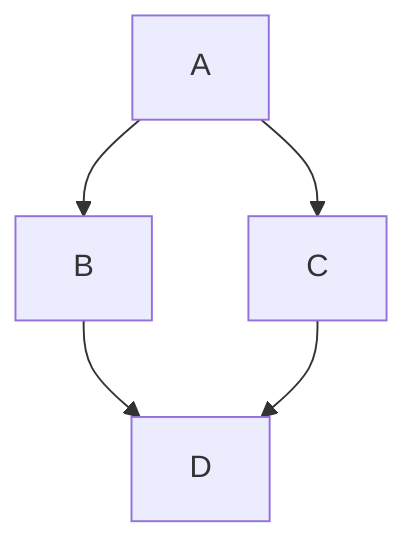

Markdown 备忘清单
===

这是 Markdown 语法的快速参考备忘单。

Markdown 快速参考
----

### 标题 (atx 风格)

```markdown
# h1
## h2
### h3
#### h4
##### h5
###### h6
```

### 标题 (setext 风格)

```markdown
Header 1
========
```

```markdown
Header 2
--------
```

### 块引用

```markdown
> 这是一个
> 块引用
>
> > 嵌套
> > 块引用
```

### 无序列表
<!--rehype:wrap-class=row-span-3-->

```markdown
* Item 1
* Item 2
    * item 3a
    * item 3b
```

或者

```markdown
- Item 1
- Item 2
```

或者

```markdown
+ Item 1
+ Item 2
```

或者**任务**列表

```markdown
- [ ] Checkbox off
- [x] Checkbox on
```

### 有序列表

```markdown
1. Item 1
2. Item 2
    a. item 3a
    b. item 3b
```

### 链接

```markdown
[link](http://google.com)

[link][google]
[google]: http://google.com

<http://google.com>
```

### 强调

```markdown
*斜体*    _斜体_    **粗体**   __粗体__

`内联代码`  ~~删除~~
```

### 水平线
<!--rehype:wrap-class=row-span-2-->

连字符

```markdown
---
```

星号

```markdown
***
```

下划线

```markdown
___
```

### 换行

```markdown
在当前行的结尾加 2 个空格··
这行就会新起一行\
反斜杠也可以换行
```

尾部添加两个空格，或者添加 `\` 反斜杠

### 代码

````markdown
```javascript
console.log("This is a block code")
```
````

````markdown
~~~css
.button { border: none; }
~~~
````

```markdown
    4 空格缩进做一个代码块
```

#### 内联代码

```markdown
`Inline code` 周围有反引号
```

### 表格

```markdown
| 左栏     | 中间栏   | 右栏  |
| -------- | -------- | ----- |
| 单元格 1 | 居中     | $1600 |
| 单元格 2 | 单元格 3 | $12   |
```

简单的风格

```markdown
左栏     | 中间栏   | 右栏  
-------- | -------- | -----
单元格 1 | 居中     | $1600
单元格 2 | 单元格 3 | $12 
```

增加 `:` 改变文字对齐方式

```markdown
左栏     |  中间栏  |   右栏 
:------- | :------: | -----: 
左对齐   |   居中   | 右对齐
```

Markdown 表格生成器：[tableconvert.com](https://tableconvert.com/)

### 脚注 (Footnotes)

```markdown
这是一个简单的脚注[^1]。

一个脚注也可以有多行[^2]。

你也可以使用文字，更贴合你的写作风格[^note]。

[^1]：我的参考。
[^2]：每个新行都应以 2 个空格为前缀。
  这允许你有一个多行的脚注。
[^note]：
    推荐使用数字命名脚注，但文本更容易识别和链接。
    脚注使用了不同的语法，使用 4 个空格作为新行。
```

### 图片
<!--rehype:wrap-class=col-span-2-->

```markdown


```

#### 带链接的图片

```markdown
[](https://github.com/)

[](link_url)
```

#### 参考风格

```markdown
![替代文字][logo]

[logo]: /images/logo.png "Logo Title"
```

### 反斜杠转义
<!--rehype:wrap-class=row-span-2-->

| 字符 | 转义 | 描述 |
|------------|--------|-------------|
| <pur>\\</pur>         | \\\\   | backslash 反斜杠             |
| <pur>\`</pur>         | \\\`   | backtick 反引号              |
| <pur>\*</pur>         | \\\*   | asterisk 星号                |
| <pur>\_</pur>         | \\\_   | underscore 下划线            |
| <pur>\{\}</pur>       | \\\{\} | curly braces 花括号          |
| <pur>\[\]</pur>       | \\\[\] | square brackets 方括号       |
| <pur>\(\)</pur>       | \\\(\) | parentheses 圆括号           |
| <pur>\#</pur>         | \\\#   | hash mark 哈希标记           |
| <pur>\+</pur>         | \\\+   | plus sign 加号               |
| <pur>\-</pur>         | \\\-   | minus sign \(hyphen\) 减号(连字符) |
| <pur>\.</pur>         | \\\.   | dot 点                      |
| <pur>\!</pur>         | \\\!   | exclamation mark 感叹号      |

### 行内 HTML 元素
<!--rehype:wrap-class=col-span-2-->

```html
目前只支持部分段内 HTML 元素效果，包括 <kbd>, <b>, <i>, <em>, <sup>, <sub>, <br>
```

Github 相关语法
----

### 代码语法高亮

````markdown
```javascript
function hello() {
    console.log("Hello, GitHub!");
}
```
````

### 任务列表
<!--rehype:wrap-class=col-span-2-->

```markdown
- [x] 已完成的任务
- [ ] 未完成的任务
- [x] @mentions, #refs, [链接](), **格式**, 和 <del>标签</del> 支持
- [x] 列表语法必填 (任何无序或有序列表支持)
- [x] 这是一个完整项目
- [ ] 这是一个未完成项目
```

### 删除线

```markdown
任何用两个波浪号包裹的词语 (例如 ~~这样~~) 都会出现删除线。
```
<!--rehype:className=wrap-text-->

### 自动链接

```markdown
http://www.github.com/ 和 https://help.github.com/ 会自动转换为链接。
```
<!--rehype:className=wrap-text-->

### @提及 和 Issues 引用

```markdown
@username 会通知用户来查看评论
#123 会引用仓库中的 issue 或 pull request
```

### 表情符号

```markdown
GitHub 支持表情符号！ :+1: :sparkles: :camel: :tada:
:rocket: :metal: :octocat:
```
<!--rehype:className=wrap-text-->

### 警告框
<!--rehype:wrap-class=row-span-2-->

```markdown
> [!NOTE]
> 有用的信息，用户需要知道，即使浏览时也是如此。

> [!TIP]
> 有用的建议，可以帮助用户做得更好。

> [!IMPORTANT]
> 用户成功所需的关键信息。

> [!WARNING]
> 用户需要立即关注的重要内容，以避免问题。

> [!CAUTION]  
> 有关可能有风险或负面结果的行为的建议。
```

### 脚注

```markdown
一个简单的脚注[^1]，一个更长的脚注[^bignote]。

[^1]: 这是第一个脚注。
[^bignote]: 这里是一个有多行的脚注。
```

### 数学公式

````markdown
行内数学：$\sqrt{3x-1}+(1+x)^2$

块级数学：

```math
\left( \sum_{k=1}^n a_k b_k \right)^2 \leq \left( \sum_{k=1}^n a_k^2 \right) \left( \sum_{k=1}^n b_k^2 \right)
```
````

GitHub 的数学呈现功能使用 MathJax，请参阅 [MathJax](http://docs.mathjax.org/en/latest/input/tex/index.html#tex-and-latex-support) 文档和 [MathJax](https://mathjax.github.io/MathJax-a11y/docs/#reader-guide) 辅助功能扩展文档。

### 折叠块

```markdown
<details>
<summary>点击展开更多详情</summary>

这是折叠的内容。

- 代码块
- 其他任何 Markdown 内容

</details>
```

### 代码块中的差异

````markdown
```diff
function addTwoNumbers (num1, num2) {
-  return 1 + 2
+  return num1 + num2
}
```
````

### 创建 Mermaid 图表

````markdown

````

有关语法文档，请参阅 [Mermaid 文档](https://mermaid.js.org)

另见
----

- [GitHub 风格的 Markdown 规范](https://github.github.com/gfm/) _(github.com)_
- [GitHub 基本写作和格式语法](https://docs.github.com/zh/get-started/writing-on-github/getting-started-with-writing-and-formatting-on-github/basic-writing-and-formatting-syntax) _(docs.github.com)_
